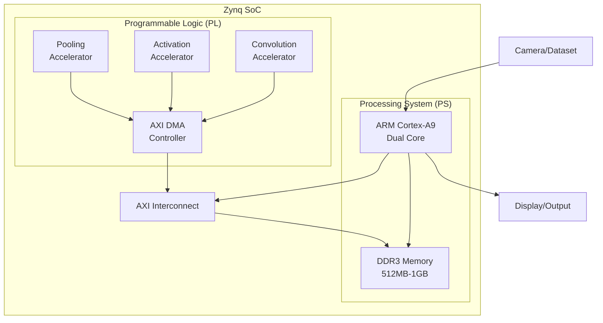
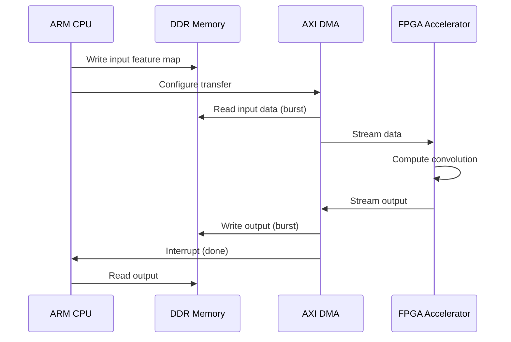

# System Architecture Documentation

## Overview

This project implements a hardware-accelerated CNN inference system on Xilinx Zynq SoC, partitioning functionality between the ARM Processing System (PS) and FPGA Programmable Logic (PL) to achieve real-time object detection with significant performance improvements over CPU-only execution.

## System Block Diagram



## Hardware/Software Partitioning

### Processing System (ARM CPU)

**Responsibilities:**
- Image capture and preprocessing
- Control flow and layer orchestration
- Fully connected layers (small overhead)
- Post-processing (softmax, classification)
- Performance monitoring
- User interface

**Rationale:**
- Sequential control logic is inefficient on FPGA
- Small FC layers don't benefit from parallelization
- Flexible for algorithm changes

### Programmable Logic (FPGA)

**Responsibilities:**
- 2D Convolution operations
- Depthwise separable convolutions
- Activation functions (ReLU, ReLU6)
- Pooling operations (max, average, global)
- High-bandwidth data movement (DMA)

**Rationale:**
- Massive parallelism for MAC operations
- Custom datapaths optimized for CNN workloads
- Pipelined execution for throughput
- Reduced memory bandwidth via on-chip buffers

## Memory Architecture

### Memory Map

| Address Range | Component | Access |
|--------------|-----------|--------|
| `0x00000000 - 0x3FFFFFFF` | DDR3 SDRAM | PS + PL |
| `0x43C00000 - 0x43C0FFFF` | Conv Accelerator Regs | PS |
| `0x43C10000 - 0x43C1FFFF` | Activation Accelerator | PS |
| `0x43C20000 - 0x43C2FFFF` | Pooling Accelerator | PS |
| `0x40400000 - 0x4040FFFF` | AXI DMA | PS |

### Data Flow



## CNN Layer Mapping

### MobileNetV1 Architecture

| Layer Type | Input Size | Output Size | Execution |
|-----------|-----------|-------------|-----------|
| Conv2D | 224×224×3 | 112×112×32 | **FPGA** |
| DW Conv + PW Conv | 112×112×32 | 112×112×64 | **FPGA** |
| DW Conv + PW Conv | 112×112×64 | 56×56×128 | **FPGA** |
| ... (11 more blocks) | ... | ... | **FPGA** |
| Global Avg Pool | 7×7×1024 | 1×1×1024 | **FPGA** |
| Fully Connected | 1024 | 1000 | CPU |
| Softmax | 1000 | 1000 | CPU |

### Optimization Strategies

**Tiling:** Large feature maps divided into tiles to fit on-chip memory

**Pipelining:** Overlapped data transfer and computation using double buffering

**Layer Fusion:** Convolution + Activation combined in single pass

**Weight Reuse:** Weights cached on-chip to reduce DDR bandwidth

## Interface Specifications

### AXI4-Lite Control Interface

Control registers for each accelerator:

```c
// Control Register (Offset 0x00)
[0] - START: Trigger computation
[1] - RESET: Reset accelerator

// Status Register (Offset 0x04)
[0] - DONE: Computation complete
[1] - IDLE: Accelerator idle

// Configuration Registers
0x08 - Input address (DDR)
0x0C - Output address (DDR)
0x10 - Weight address (DDR)
0x14 - Layer configuration (dimensions, stride, etc.)
```

### AXI4 Memory-Mapped Interface

- **Data Width:** 64-bit
- **Burst Length:** Up to 256 beats
- **Address Space:** Full 32-bit DDR range
- **Cache Coherency:** Not maintained (manual flush required)

## Resource Utilization Targets

For Zynq-7020 (ZedBoard):

| Resource | Available | Target Usage | Percentage |
|----------|-----------|--------------|------------|
| LUTs | 53,200 | ~40,000 | 75% |
| FFs | 106,400 | ~50,000 | 47% |
| BRAM | 140 (4.9 Mb) | ~100 | 71% |
| DSP48 | 220 | ~180 | 82% |

## Timing Constraints

- **FPGA Clock:** 100 MHz (10 ns period)
- **PS Clock:** 666 MHz
- **AXI Clock:** 100 MHz
- **Critical Path:** Convolution MAC array

## Power Budget

- **Idle Power:** ~1.5W
- **CPU-only Inference:** ~2.5W
- **FPGA-accelerated:** ~3.5W
- **Power Efficiency Target:** 2× performance per watt improvement
